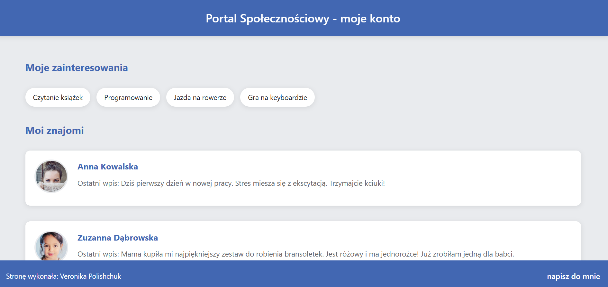

# Social Portal Website  
A social portal website that displays user profiles and friend connections. Built with PHP and MySQL (managed via phpMyAdmin), it provides a responsive, modern web interface for browsing and interacting with users.

## Features  
- User profiles with photo, name, and recent activity  
- Personal interests list  
- Data dynamically retrieved from MySQL  
- Responsive modern design  

## Technologies  
- PHP 8.2  
- MySQL / MariaDB (phpMyAdmin)  
- HTML5 & CSS3  

## Screenshot

